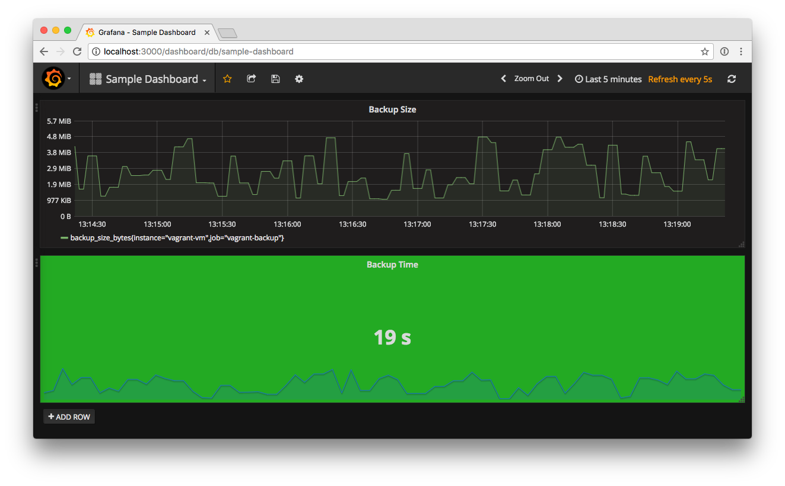

# Prometheus Experiments

Trying out [Prometheus](https://prometheus.io), an open-source monitoring solution; and [Grafana](https://grafana.net), an open-source metrics visualization tool.

What this demo will do (in a Vagrant VM):

* Run an instance of Prometheus (exposed on port 9090)
* Run a [push gateway](https://github.com/prometheus/pushgateway) for Prometheus so that it can accept metrics from ephemeral jobs
* Run a Node.js fake backup script that will publish metrics to the push gateway every 5 seconds
* Run a Grafana instance (exposed on port 3000) and configure it to display the metrics from Prometheus

## Requirements

* [Vagrant](https://www.vagrantup.com) 1.9+
* A Vagrant-supported virtual machine provider like [VirtualBox](http://virtualbox.org) or [VMWare](http://www.vmware.com)
* Ports 3000 and 9090 must be free to run the Vagrant VM

## Usage

```
vagrant up
```

**Grab a coffee...** this will take a while.

* Visit [http://localhost:3000](http://localhost:3000) to see Grafana (log in with username `admin` and password `admin`)
* Visit [http://localhost:9090](http://localhost:9090) to see the Prometheus backend


